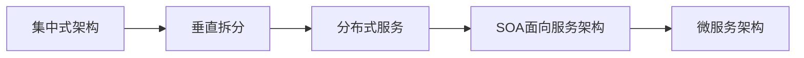

# spring cloud-Eureka

启动eureka时候

```log
Caused by: java.lang.ClassNotFoundException: javax.xml.bind.JAXBContext
	at java.base/jdk.internal.loader.BuiltinClassLoader.loadClass(BuiltinClassLoader.java:581) ~[na:na]
	at java.base/jdk.internal.loader.ClassLoaders$AppClassLoader.loadClass(ClassLoaders.java:178) ~[na:na]
```

是因为JDK版本过高

可以降低JDK版本，或者导入依赖

```xml

        <dependency>
            <groupId>javax.xml.bind</groupId>
            <artifactId>jaxb-api</artifactId>
            <version>2.3.0</version>
        </dependency>
        <dependency>
            <groupId>com.sun.xml.bind</groupId>
            <artifactId>jaxb-impl</artifactId>
            <version>2.3.0</version>
        </dependency>
        <dependency>
            <groupId>com.sun.xml.bind</groupId>
            <artifactId>jaxb-core</artifactId>
            <version>2.3.0</version>
        </dependency>
        <dependency>
            <groupId>javax.activation</groupId>
            <artifactId>activation</artifactId>
            <version>1.1.1</version>
		</dependency>
```


## 一、初识spring cloud

- 微服务架构
- 走进 Spring Cloud
- Spring Cloud 与 Dubbo 对比


### 1. 系统架构演变概述

**目标**：了解项目架构的演变历程

**小结**：




### 2. 微服务架构说明

**目标**：了解SOA与微服务架构的区别以及说出微服务架构的特点

**分析**：

SOA使用了ESB组件的面向服务架构：ESB自身实现复杂；应用服务粒度较大，所有服务之间的通信都经过ESB会降低通信速度；部署、测试ESB比较麻烦。

**小结**：

**微服务架构**：是一套使用小服务或者单一业务来开发单个应用的方式或途径。

微服务架构特点：

- 单一职责
- 服务粒度小
- 面向服务（对外暴露REST api）
- 服务之间相互独立

与使用ESB的SOA架构的区别：微服务架构没有使用ESB，有服务治理注册中心；业务粒度小。


### 3.走进**Spring Cloud**

•Spring Cloud 是一系列框架的有序集合。

•Spring Cloud 并没有重复制造轮子，它只是将目前各家公司开发的比较成熟、经得起实际考验的服务框架组合起来。

•通过 Spring Boot 风格进行再封装屏蔽掉了复杂的配置和实现原理，最终给开发者留出了一套简单易懂、易部署和易维护的分布式系统开发工具包。

•它利用Spring Boot的开发便利性巧妙地简化了分布式系统基础设施的开发，如服务发现注册、配置中心、消息总线、负载均衡、 断路器、数据监控等，都可以用Spring Boot的开发风格做到一键启动和部署。

•Spring Cloud项目官方网址：https://spring.io/projects/spring-cloud 


### 4.Spring Cloud 与 Dubbo 对比


•微服务就是将项目的各个模块拆分为可独立运行、部署、测试的架构设计风格。

•Spring 公司将其他公司中微服务架构常用的组件整合起来，并使用 SpringBoot 简化其开发、配置。称为 Spring Cloud

•Spring Cloud 与 Dubbo都是实现微服务有效的工具。Dubbo 性能更好，而 Spring Cloud 功能更全面。


### 5. 服务调用方式说明

**目标**：能够说出服务调用方式种类

**小结**：

- RPC：基于socket，速度快，效率高；webservice、dubbo
- HTTP：基于TCP，封装比较臃肿；对服务和调用方没有任何技术、语言的限定，自由灵活；RESTful，Spring Cloud


## 二、**Spring Cloud** **服务治理**(注册中心)

- Eureka
- Consul
- Nacos


### 1.**Eureka**

•Eureka 是 Netflix 公司开源的一个服务注册与发现的组件 。

•Eureka 和其他 Netflix 公司的服务组件（例如负载均衡、熔断器、网关等） 一起，被 Spring Cloud 社区整合为

  Spring-Cloud-Netflix 模块。 

•Eureka 包含两个组件：Eureka Server (注册中心) 和 Eureka Client (服务提供者、服务消费者)。


### 2.**Eureka**步骤(jdk1.8)

1.搭建 Provider 和 Consumer 服务。

2.使用 RestTemplate 完成远程调用。

3.搭建 Eureka Server 服务。

4.改造 Provider 和 Consumer 称为 Eureka Client。

5.Consumer 服务 通过从 Eureka Server 中抓取 Provider 地址 完成 远程调用康康，


### **3.Eureka –** **搭建服务**

<font color = "red">1.搭建 Provider 和 Consumer 服务。</font>

2.使用 RestTemplate 完成远程调用。

3.搭建 Eureka Server 服务。

4.改造 Provider 和 Consumer 称为 Eureka Client。

5.Consumer 服务 通过从 Eureka Server 中抓取 Provider 地址 完成 远程调用


Provider：

```java
@RestController
@RequestMapping("/goods")
public class Controller {

    @Autowired
    private GoodsService goodsService;

    @RequestMapping("/findOne/{id}")
    public Goods findOne(@PathVariable("id") int id) {
        Goods goods = goodsService.findOne(id);
        return goods;

    }
}
```


```java
@Service
public class GoodsService {

    @Autowired
    private GoodsDao goodsDao;

    public Goods findOne(int id) {
        return goodsDao.findOne(id);
    }
}

```


Consumer：

```java
@RestController
@RequestMapping("/order")
public class OrderController {

    @GetMapping("/goods/{id}")
    public Goods findGoodsById(@PathVariable("id") int id) {
        System.out.println("findGoodsById..."+id);
        return null;
    }
}
```


### 4.**Eureka – RestTemplate**

1.搭建 Provider 和 Consumer 服务。

<font color = "red">2.使用 RestTemplate 完成远程调用。</font>

3.搭建 Eureka Server 服务。

4.改造 Provider 和 Consumer 称为 Eureka Client。

5.Consumer 服务 通过从 Eureka Server 中抓取 Provider 地址 完成 远程调用


<font color = "red">RestTemplate</font>

•Spring提供的一种简单便捷的模板类，用于在 java 代码里访问 restful 服务。

•其功能与 HttpClient 类似，但是 RestTemplate 实现更优雅，使用更方便。


```java
@RestController
@RequestMapping("/order")
public class OrderController {

    @Autowired
    private RestTemplate restTemplate;


    @GetMapping("/goods/{id}")
    public Goods findGoodsById(@PathVariable("id") int id) {
        System.out.println("findGoodsById..."+id);
        // 远程调用Goods服务中的findOne接口
        // 使用RestTemplate
        // 1 定义Bean restTemplate
        // 2 注入Bean
        // 3 调用方法
        String url = "http://localhost:8000/goods/findOne/2";
        Goods goods = restTemplate.getForObject(url, Goods.class);
        return goods;
    }
}
```


```java
@Configuration
public class RestTemplateConfig {

    @Bean
    public RestTemplate restTemplate() {
        return new RestTemplate();
    }
}
```


### 5.**Eureka – Eureka Server**

1.搭建 Provider 和 Consumer 服务。

2.使用 RestTemplate 完成远程调用。

<font color = "red">3.搭建 Eureka Server 服务。</font>

4.改造 Provider 和 Consumer 称为 Eureka Client。

5.Consumer 服务 通过从 Eureka Server 中抓取 Provider 地址 完成 远程调用


①创建 eureka-server 模块

②引入 SpringCloud 和 euraka-server 相关依赖

③完成 Eureka Server 相关配置

④启动该模块


```java
@SpringBootApplication
//启用EurekaServer
@EnableEurekaServer
public class EurekaApp {
    public static void main(String[] args) {
        SpringApplication.run(EurekaApp.class,args);
    }
}
```


application.yml

```yml
server:
  port: 8761

# eureka 配置
# eureka 一共有四部分配置
# 1 dashboard：eureka的web控制台配置
# 2 server：eureka的服务端配置
# 3 client：eureka的客户端配置
# 4 instance：eureka的实例配置
eureka:
  instance:
    hostname: localhost

# eureka 服务端默认地址（可以不配置），将来客户端使用该地址和eureka进行通讯
  client:
    service-url:
      defaultZone: http://${eureka.instance.hostname}:${server.port}}/eureka
    # 是否将自己的路径 注册到eureka上（客户机provide才需要注册！）
    register-with-eureka: false
    # 是否需要从eureka中抓取路径（客户机consumer才需要注册！）
    fetch-registry: false

```


### 6.改造 Provider 和 Consumer 称为 Eureka Client

1.搭建 Provider 和 Consumer 服务。

2.使用 RestTemplate 完成远程调用。

3.搭建 Eureka Server 服务。

<font color = "red">4.改造 Provider 和 Consumer 称为 Eureka Client。</font>

5.Consumer 服务 通过从 Eureka Server 中抓取 Provider 地址 完成 远程调用


①引 eureka-client 相关依赖

②完成 eureka client 相关配置

③启动 测试


```java
@SpringBootApplication
@EnableEurekaClient
public class ConsumerApp {
    public static void main(String[] args) {
        SpringApplication.run(ConsumerApp.class,args);
    }
}
```

application.yml

```yml
server:
  port: 9000


eureka:
  instance:
    hostname: localhost
  client:
    service-url:
      defaultZone: http://localhost:8761/eureka

spring:
  application:
    name: eureka-consumer #设置当前应用的名称，将来会在eureka中显示，将来需要使用该名称来获取路径

```


### 7.完成远程调用

1.搭建 Provider 和 Consumer 服务。

2.使用 RestTemplate 完成远程调用。

3.搭建 Eureka Server 服务。

4.改造 Provider 和 Consumer 称为 Eureka Client。

<font color ="red">5.Consumer 服务 通过从 Eureka Server 中抓取 Provider 地址 完成 远程调用</font>.


```java
@EnableDiscoveryClient//激活DiscoveryClient对象
@SpringBootApplication
@EnableEurekaClient
public class ConsumerApp {
    public static void main(String[] args) {
        SpringApplication.run(ConsumerApp.class,args);
    }
}
```


```java
@RestController
@RequestMapping("/order")
public class OrderController {

    @Autowired
    private RestTemplate restTemplate;

    @Autowired
    private DiscoveryClient discoveryClient;


    @GetMapping("/goods/{id}")
    public Goods findGoodsById(@PathVariable("id") int id) {
        System.out.println("findGoodsById..."+id);
        // 远程调用Goods服务中的findOne接口
        // 使用RestTemplate
        // 1 定义Bean restTemplate
        // 2 注入Bean
        // 3 调用方法

        // 动态从Eureka Server中获取provider的 ip 和 接口
        // 1 注入 DiscoveryClient对象,激活
        // 2 调用方法
        List<ServiceInstance> instances = discoveryClient.getInstances("EUREKA-PROVIDER");
        //判断集合是否有数据
        if(instances == null || instances.size() == 0) {
            return null;
        }
        ServiceInstance instance = instances.get(0);
        String host = instance.getHost();
        int port = instance.getPort();

        String url = "http://"+host+":"+port+"/goods/findOne/2";
        Goods goods = restTemplate.getForObject(url, Goods.class);
        return goods;
    }
}
```


## 三、**Eureka –** **相关配置及特性**

eureka 一共有4部分 配置

1.server : eureka 的服务端配置

2.client : eureka 的客户端配置

3.instance : eureka 的实例配置

4.dashboard : eureka 的web控制台配置


### **Eureka –** **相关配置及特性** **- instance** 


```yml
server:
  port: 8001

eureka:
  instance:
    hostname: localhost # 主机名
    prefer-ip-address: true # 将当前实例的ip注册到eureka server 中。默认是false 注册主机名
    ip-address: 127.0.0.1 # 设置当前实例的ip
    instance-id: ${eureka.instance.ip-address}:${spring.application.name}:${server.port} # 设置web控制台显示的 实例id
  client:
    service-url:
      defaultZone: http://localhost:8761/eureka
spring:
  application:
    name: feign-provider # 设置当前应用的名称。将来会在eureka中Application显示。将来需要使用该名称来获取路径


```


### **Eureka –** **相关配置及特性** **- server**


**server：**


**client：**


### **Eureka –** **相关配置及特性** **- client**


### **Eureka –** **相关配置及特性** **- dashboard** 


## 四、Eureka高可用


在单机情况下，为了区分，需要修改主机默认名字


第一个server

```yml
server:
  port: 8761

# eureka 配置
# eureka 一共有四部分配置
# 1 dashboard：eureka的web控制台配置
# 2 server：eureka的服务端配置
# 3 client：eureka的客户端配置
# 4 instance：eureka的实例配置
eureka:
  instance:
    hostname: eureka-server1 #需要修改本机的默认ip的主机名（在单机情况下）

# eureka 服务端默认地址（可以不配置），将来客户端使用该地址和eureka进行通讯
  client:
    service-url:
      defaultZone: http://eureka-server2:8762/eureka # 相互注册
    register-with-eureka: true # true 和 false 都行
    fetch-registry: true # true 和 false 都行
spring:
  application:
    name: eureka-server-ha

```


第二个server

```yml
server:
  port: 8762

# eureka 配置
# eureka 一共有四部分配置
# 1 dashboard：eureka的web控制台配置
# 2 server：eureka的服务端配置
# 3 client：eureka的客户端配置
# 4 instance：eureka的实例配置
eureka:
  instance:
    hostname: eureka-server2

# eureka 服务端默认地址（可以不配置），将来客户端使用该地址和eureka进行通讯
  client:
    service-url:
      defaultZone: http://eureka-server1:8761/eureka # 相互注册
    # 是否将自己的路径 注册到eureka上（客户机provide才需要注册！）
    register-with-eureka: true
    # 是否需要从eureka中抓取路径（客户机consumer才需要注册！）
    fetch-registry: true
spring:
  application:
    name: eureka-server-ha

```


client:


## 二（other）

### 5. Spring Cloud概述

**目标**：Spring Cloud整合的组件和版本特征

**小结**：

- 整合的组件可以有很多组件；常见的组件有：eureka注册中心，Gateway网关，Ribbon负载均衡，Feign服务调用，Hystrix熔断器。在有需要的时候项目添加对于的启动器依赖即可。
- 版本特征：以英文单词命名（伦敦地铁站名）

### 6. 创建微服务工程

**目标**：创建微服务父工程heima-springcloud、用户服务工程user-service、服务消费工程consumer-demo

**分析**：

需求：查询数据库中的用户数据并输出到浏览器

- 父工程heima-springcloud：添加spring boot父坐标和管理其它组件的依赖
- 用户服务工程user-service：整合mybatis查询数据库中用户数据；提供查询用户服务
- 服务消费工程consumer-demo：利用查询用户服务获取用户数据并输出到浏览器

**小结**：

```xml
            <!-- springCloud -->
            <dependency>
                <groupId>org.springframework.cloud</groupId>
                <artifactId>spring-cloud-dependencies</artifactId>
                <version>${spring-cloud.version}</version>
                <type>pom</type>
                <scope>import</scope>
            </dependency>

```

通过 `scope` 的import可以继承 `spring-cloud-dependencies` 工程中的依赖

### 7. 搭建配置user-service工程

**目标**：配置user-service工程并能够根据用户id查询数据库中用户

**分析**：

需求：可以访问http://localhost:9091/user/8输出用户数据

实现步骤：

1. 添加启动器依赖（web、通用Mapper）；
2. 创建启动引导类和配置文件；
3. 修改配置文件中的参数；
4. 编写测试代码（UserMapper，UserService，UserController）；
5. 测试

**小结**：

- 添加启动器依赖

```xml
    <dependencies>
        <dependency>
            <groupId>org.springframework.boot</groupId>
            <artifactId>spring-boot-starter-web</artifactId>
        </dependency>
        <!-- 通用Mapper启动器 -->
        <dependency>
            <groupId>tk.mybatis</groupId>
            <artifactId>mapper-spring-boot-starter</artifactId>
        </dependency>
        <!-- mysql驱动 -->
        <dependency>
            <groupId>mysql</groupId>
            <artifactId>mysql-connector-java</artifactId>
        </dependency>

    </dependencies>

```


- 编写配置文件

```yml
server:
  port: 9091
spring:
  datasource:
    driver-class-name: com.mysql.jdbc.Driver
    url: jdbc:mysql://localhost:3306/springcloud
    username: root
    password: root

mybatis:
  type-aliases-package: com.itheima.user.pojo

```


### 8. 搭建配置consumer-demo工程

**目标**：编写测试类使用restTemplate访问user-service的路径根据id查询用户

**分析**：

需求：访问http://localhost:8080/consumer/8 使用RestTemplate获取http://localhost:9091/user/8的数据

实现步骤：

1. 添加启动器依赖；
2. 创建启动引导类（注册RestTemplate）和配置文件；
3. 编写测试代码（ConsumerController中使用restTemplate访问服务获取数据）
4. 测试

**小结**：

- 服务管理
  如何自动注册和发现
  如何实现状态监管
  如何实现动态路由
- 服务如何实现负载均衡
- 服务如何解决容灾问题
- 服务如何实现统一配置

上述的问题都可以通过Spring Cloud的各种组件解决。

### 9. Eureka注册中心说明

**目标**：说出Eureka的主要功能

**小结**：

Eureka的主要功能是进行服务管理，定期检查服务状态，返回服务地址列表。


### 10. 搭建eureka-server工程

**目标**：添加eureka对应依赖和编写引导类搭建eureka服务并可访问eureka服务界面

**分析**：

Eureka是服务注册中心，只做服务注册；自身并不提供服务也不消费服务。可以搭建web工程使用Eureka，可以使用Spring Boot方式搭建。

搭建步骤：

1. 创建工程；
2. 添加启动器依赖；
3. 编写启动引导类（添加Eureka的服务注解）和配置文件；
4. 修改配置文件（端口，应用名称...）；
5. 启动测试

**小结**：

- 启动器依赖

```xml
        <dependency>
            <groupId>org.springframework.cloud</groupId>
            <artifactId>spring-cloud-starter-netflix-eureka-server</artifactId>
        </dependency>
```


- 配置文件

```yml
server:
  port: 10086
spring:
  application:
    name: eureka-server
eureka:
  client:
    service-url:
      # eureka 服务地址，如果是集群的话；需要指定其它集群eureka地址
      defaultZone: http://127.0.0.1:10086/eureka
    # 不注册自己
    register-with-eureka: false
    # 不拉取服务
    fetch-registry: false
```


### 11. 服务注册与发现

**目标**：将user-service的服务注册到eureka并在consumer-demo中可以根据服务名称调用

**分析**：

- 服务注册：在服务提供工程user-service上添加Eureka客户端依赖；自动将服务注册到EurekaServer服务地址列表。
  - 添加依赖；
  - 改造启动引导类；添加开启Eureka客户端发现的注解；
  - 修改配置文件；设置Eureka 服务地址
- 服务发现：在服务消费工程consumer-demo上添加Eureka客户端依赖；可以使用工具类根据服务名称获取对应的服务地址列表。
  - 添加依赖；
  - 改造启动引导类；添加开启Eureka客户端发现的注解；
  - 修改配置文件；设置Eureka 服务地址；
  - 改造处理器类ConsumerController，可以使用工具类DiscoveryClient根据服务名称获取对应服务地址列表。

**小结**：

- 添加Eureka客户端依赖；

```xml
        <dependency>
            <groupId>org.springframework.cloud</groupId>
            <artifactId>spring-cloud-starter-netflix-eureka-client</artifactId>
        </dependency>

```

- 添加启动引导类注解；

  

- 修改配置

```yml
spring:
  application:
    name: consumer-demo
eureka:
  client:
    service-url:
      defaultZone: http://127.0.0.1:10086/eureka
```


### 12. Eureka Server高可用配置

**目标**：可以启动两台eureka-server实例；在eureka管理界面看到两个实例

**分析**：

Eureka Server是一个web应用，可以启动多个实例（配置不同端口）保证Eureka Server的高可用。

**小结**：

**高可用配置**：将Eureka Server作为一个服务注册到其它Eureka Server，这样多个Eureka Server之间就能够互相发现对方，同步服务，实现Eureka Server集群。

### 13. Eureka客户端与服务端配置

**目标**：配置eureka客户端user-service的注册、续约等配置项，配置eureka客户端consumer-demo的获取服务间隔时间；了解失效剔除和自我保护

**分析**：

- Eureka客户端工程
  - user-service 服务提供
    - 服务地址使用ip方式
    - 续约
  - consumer-demo 服务消费
    - 获取服务地址的频率
- Eureka服务端工程 eureka-server
  - 失效剔除
  - 自我保护

**小结**：

- user-service 

```yml
eureka:
  client:
    service-url:
      defaultZone: http://127.0.0.1:10086/eureka
  instance:
    # 更倾向使用ip地址，而不是host名
    prefer-ip-address: true
    # ip地址
    ip-address: 127.0.0.1
    # 续约间隔，默认30秒
    lease-renewal-interval-in-seconds: 5
    # 服务失效时间，默认90秒
    lease-expiration-duration-in-seconds: 5
```


- consumer-demo 

```yml
eureka:
  client:
    service-url:
      defaultZone: http://127.0.0.1:10086/eureka
    # 获取服务地址列表间隔时间，默认30秒
    registry-fetch-interval-seconds: 10
```


- eureka-server

```yml
eureka:
  server:
    # 服务失效剔除时间间隔，默认60秒
    eviction-interval-timer-in-ms: 60000
    # 关闭自我保护模式（默认是打开的）
    enable-self-preservation: false
```


### 14. 负载均衡Ribbon简介

**目标**：描述负载均衡和ribbon的作用

**分析**：

负载均衡是一个算法，可以通过该算法实现从地址列表中获取一个地址进行服务调用。

在Spring Cloud中提供了负载均衡器：Ribbon


**小结**：

Ribbon提供了轮询、随机两种负载均衡算法（默认是轮询）可以实现从地址列表中使用负载均衡算法获取地址进行服务调用。

### 15. Ribbon负载均衡应用

**目标**：配置启动两个用户服务，在consumer-demo中使用服务名实现根据用户id获取用户

**分析**：

需求：可以使用RestTemplate访问http://user-service/user/8获取服务数据。

可以使用Ribbon负载均衡：在执行RestTemplate发送服务地址请求的时候，使用负载均衡拦截器拦截，根据服务名获取服务地址列表，使用Ribbon负载均衡算法从服务地址列表中选择一个服务地址，访问该地址获取服务数据。

实现步骤：

1. 启动多个user-service实例（9091,9092）；
2. 修改RestTemplate实例化方法，添加负载均衡注解；
3. 修改ConsumerController；
4. 测试

**小结**：

在实例化RestTemplate的时候使用@LoadBalanced，服务地址直接可以使用服务名。

### 16. 熔断器Hystrix简介

**目标**：了解熔断器Hystrix的作用

**小结**：

Hystrix是一个延迟和容错库，用于隔离访问远程服务，防止出现级联失败。

### 17. 线程隔离&服务降级

**目标**：了解什么是线程隔离和服务降级

**分析**：

Hystrix解决雪崩效应：

- 线程隔离：用户请求不直接访问服务，而是使用线程池中空闲的线程访问服务，加速失败判断时间。
- 服务降级：及时返回服务调用失败的结果，让线程不因为等待服务而阻塞。

**小结**：

- 添加依赖

```xml
        <dependency>
            <groupId>org.springframework.cloud</groupId>
            <artifactId>spring-cloud-starter-netflix-hystrix</artifactId>
        </dependency>
```

- 开启熔断

   

- 降级逻辑

```java
@RestController
@RequestMapping("/consumer")
@Slf4j
@DefaultProperties(defaultFallback = "defaultFallback")
public class ConsumerController {

    @Autowired
    private RestTemplate restTemplate;

    @Autowired
    private DiscoveryClient discoveryClient;

    @GetMapping("/{id}")
    //@HystrixCommand(fallbackMethod = "queryByIdFallback")
    @HystrixCommand
    public String queryById(@PathVariable Long id){
        /*String url = "http://localhost:9091/user/"+id;
        
        //获取eureka中注册的user-service的实例
        List<ServiceInstance> serviceInstances = discoveryClient.getInstances("user-service");
        ServiceInstance serviceInstance = serviceInstances.get(0);

        url = "http://" + serviceInstance.getHost() + ":" + serviceInstance.getPort() + "/user/" + id;*/
        String url = "http://user-service/user/" + id;
        return restTemplate.getForObject(url, String.class);
    }

    public String queryByIdFallback(Long id){
        log.error("查询用户信息失败。id：{}", id);
        return "对不起，网络太拥挤了！";
    }

    public String defaultFallback(){
        return "默认提示：对不起，网络太拥挤了！";
    }
}

```


- 修改超时配置

```yml
hystrix:
  command:
    default:
      execution:
        isolation:
          thread:
            timeoutInMilliseconds: 2000
```


### 18. 服务熔断演示

**目标**：了解熔断器工作原理

**小结**：


可以通过配置服务熔断参数修改默认：

```yml
hystrix:
  command:
    default:
      execution:
        isolation:
          thread:
            timeoutInMilliseconds: 2000
      circuitBreaker:
        errorThresholdPercentage: 50 # 触发熔断错误比例阈值，默认值50%
        sleepWindowInMilliseconds: 10000 # 熔断后休眠时长，默认值5秒
        requestVolumeThreshold: 10 # 熔断触发最小请求次数，默认值是20
```


# **Ribbon** **客户端负载均衡**


## 1.**Ribbon** **概述**


## 2.**Ribbon** **远程调用**

•Ribbon 可以与 简化 RestTemplate 的远程调用


config：

```java
@Configuration
public class RestTemplateConfig {
    @LoadBalanced
    @Bean
    public RestTemplate restTemplate() {
        return new RestTemplate();
    }
}
```


web：

```java
@RestController
@RequestMapping("/order")
public class OrderController {

    @Autowired
    private RestTemplate restTemplate;

    @Autowired
    private DiscoveryClient discoveryClient;

    // 使用 Ribbon 简化了restTemplate调用
    // 1 在声明restTemplate的Bean时候，添加一个注解：@LoadBalanced
    // 2 在使用restTemplate发起请求时，需要定义url时，host：port可以替换成：服务提供方的应用名称
    @LoadBalanced
    @GetMapping("/goods/{id}")
    public Goods findGoodsById(@PathVariable("id") int id) {

        String url = "http://eureka-provider/goods/findOne/1";
        Goods goods = restTemplate.getForObject(url, Goods.class);
        return goods;
    }
}
```


## **3.Ribbon** **负载均衡**


Ribbon 负责均衡策略：

- 随机 ：RandomRule
- 轮询 ：RoundRobinRule
- 最小并发：BestAvailableRule
- 过滤：AvailabilityFilteringRule
- 响应时间：WeightedResponseTimeRule
- 轮询重试：RetryRule
- 性能可用性：ZoneAvoidanceRule


1.编码(consumer)


2.yml(consumer)


# Feign 声明式服务调用


## **Feign** **概述**

•Feign 是一个声明式的 REST 客户端，它用了基于接口的注解方式，很方便实现客户端配置。

•Feign 最初由 Netflix 公司提供，但不支持SpringMVC注解，后由 SpringCloud 对其封装，支持了SpringMVC注解，让使用者更易于接受。


## **Feign** **快速入门**

1.在消费端引入 open-feign 依赖

2.编写Feign调用接口

3.在启动类 添加 @EnableFeignClients 注解，开启Feign功能

4.测试调用


1 导入依赖（consumer中）

```xml
        <dependency>
            <groupId>org.springframework.cloud</groupId>
            <artifactId>spring-cloud-openfeign</artifactId>
            <version>2.2.7.RELEASE</version>
        </dependency>
```

```java
@EnableDiscoveryClient//激活DiscoveryClient对象
@SpringBootApplication
@EnableEurekaClient
@EnableFeignClients // 开启Feign的功能
public class ConsumerApp {
    public static void main(String[] args) {
        SpringApplication.run(ConsumerApp.class,args);
    }
}
```


2.编写Feign调用接口src/main/java/org/example/consumer/feign/GoodsFeignClient.java

```java
/**
 * feign声明式接口，发起远程调用
 * 简化了以下代码
 * String url = "http://EUREKA-PROVIDER/goods/findOne/1";
 * Goods goods = restTemplate.getForObject(url, Goods.class);
 *
 * 1 . 定义接口
 * 2 . 接口上添加注解@FeignClient，设置value属性为 服务提供者 的应用名称
 * 3 . 编写调用接口，接口的声明规则 和 提供方接口保持一致
 * */
public interface GoodsFeignClient {
    @RequestMapping("/goods/findOne/{id}")
    public Goods findGoodsById(@PathVariable("id") int id);
}
```


调用接口

```java
    @Autowired
    private GoodsFeignClient goodsFeignClient;

    // 使用 Ribbon 简化了restTemplate调用
    // 1 在声明restTemplate的Bean时候，添加一个注解：@LoadBalanced
    // 2 在使用restTemplate发起请求时，需要定义url时，host：port可以替换成：服务提供方的应用名称
    @LoadBalanced
    @GetMapping("/goods/{id}")
    public Goods findGoodsById(@PathVariable("id") int id) {

//        String url = "http://EUREKA-PROVIDER/goods/findOne/1";
//        Goods goods = restTemplate.getForObject(url, Goods.class);
//        return goods;
        Goods goodsById = goodsFeignClient.findGoodsById(id);
        return goodsById;
    }
```


<font color = "red">实际上@FeginClient帮你在eureka中通过springid寻找对应的ip和端口，然后帮我们拼接字符串组成url，最后完成远程调用</font>


## **Feign** **其他功能** **–** **超时设置**

•Feign 底层依赖于 Ribbon 实现负载均衡和远程调用。

•Ribbon默认1秒超时。

•超时配置：

```yml
ribbon:
  ConnectTimeout**: 1000  #连接超时时间,毫秒
  ReadTimeout**: 1000   #逻辑处理超时时间,毫秒
```


## **Feign** **其他功能** **–** **日志记录**


\


# Hystrix 熔断器

- Hystrix 概述
- Hystrix 降级
- Hystrix 熔断
- Hystrix 熔断监控


## **Hystrix** **概述**

•Hystix 是 Netflix 开源的一个延迟和容错库，用于隔离访问远程服务、第三方库，防止出现级联失败（雪崩）。


•Hystix 是 Netflix 开源的一个延迟和容错库，用于隔离访问远程服务、第三方库，防止出现级联失败（雪崩）。

•雪崩：一个服务失败，导致整条链路的服务都失败的情形。

### Hystix 主要功能

- 隔离
- 降级
- 熔断
- 限流


线程隔离&服务降级

**目标**：了解什么是线程隔离和服务降级

**分析**：

Hystrix解决雪崩效应：

- 线程隔离：用户请求不直接访问服务，而是使用线程池中空闲的线程访问服务，加速失败判断时间。
- 服务降级：及时返回服务调用失败的结果，让线程不因为等待服务而阻塞。


#### 隔离：

##### 线程池隔离

信号量隔离


信号量隔离：比如最多只能四十个线程进入c

##### 信号量隔离


#### 降级

在A、C分别留下预案


#### 熔断

错误次数太多了，就熔断，C恢复之后，就重新连接

#### 限流

**目标**：了解熔断器Hystrix的作用

**小结**：

Hystrix是一个延迟和容错库，用于隔离访问远程服务，防止出现级联失败。


## **Hystrix** **降级**

•Hystix 降级：当服务发生异常或调用超时，返回默认数据


#### **Hystrix** **降级** **–** **服务提供方**

1.在服务提供方，引入 hystrix 依赖

2.定义降级方法

3.使用 @HystrixCommand 注解配置降级方法

4.在启动类上开启Hystrix功能：@EnableCircuitBreaker


1导入依赖

```xml
        <dependency>
            <groupId>org.springframework.cloud</groupId>
            <artifactId>spring-cloud-starter-netflix-hystrix</artifactId>
        </dependency>
```

启动类

```java
@EnableEurekaClient //该注解 在新版本中可以省略
@SpringBootApplication
@EnableCircuitBreaker // 开启熔断器
public class ProviderApp {
    public static void main(String[] args) {
        SpringApplication.run(ProviderApp.class,args);
    }
}
```


降级

```java
    @Value("${server.port}")
    private int port;

     /** 降级：
         * 1 出现异常
         * 2 服务调用超时（默认1s）
      */
    @GetMapping("/findOne/{id}")
    @HystrixCommand(fallbackMethod = "findOne_fallback") // 指定降级后调用的方法
    public Goods findOne(@PathVariable("id") int id){

        Goods goods = goodsService.findOne(id);

        goods.setTitle(goods.getTitle() + ":" + port);//将端口号，设置到了 商品标题上
        return goods;
    }

    /**
     * 定义降级方法：
     * 1 方法的返回值需要和原方法一样
     * 2 方法的参数需要和原方法一样
     */
    public Goods findOne_fallback(int id) {
        Goods goods = new Goods();
        goods.setTitle("降级了~");
        return goods;
    }
```


#### **Hystrix** **降级** **–** **服务消费方**

1.feign 组件已经集成了 hystrix 组件。

2.定义feign 调用接口实现类，复写方法，即 降级方法

3.在 @FeignClient 注解中使用 fallback 属性设置降级处理类。

4.配置开启 feign.hystrix.enabled = true


开启feign的hystrix

```yml
# 开启feign对hystrix的支持
feign:
  hystrix:
    enabled: true
```


Feign的实现类

```java
/**
 * Feign客户端的降级处理类
 * 1 定义类 实现Feign客户端接口
 * 2 使用@Component注解将该类的Bean加入SpringIOC容器
 */
@Component
public class GoodsFeignClientFallback implements GoodsFeignClient{
    @Override
    public Goods findGoodsById(int id) {
        return null;
    }
}
```

接口：

```java
@FeignClient(value = "HYSTRIX-PROVIDER",fallback =  GoodsFeignClientFallback.class)
public interface GoodsFeignClient {


    @GetMapping("/goods/findOne/{id}")
    public Goods findGoodsById(@PathVariable("id") int id);

}

```


## **Hystrix** **熔断**（面试）

•Hystrix 熔断机制，用于监控微服务调用情况，当失败的情况达到预定的阈值（5秒失败20次），会打开断路器，拒绝所有请求，直到服务恢复正常为止。

•circuitBreaker.sleepWindowInMilliseconds：监控时间

•circuitBreaker.requestVolumeThreshold：失败次数

•circuitBreaker.errorThresholdPercentage：失败率


​                       断路器状态


## **Hystrix** **熔断**监控

•Hystrix 提供了 Hystrix-dashboard 功能，用于实时监控微服务运行状态。

•但是Hystrix-dashboard只能监控一个微服务。

•Netflix 还提供了 Turbine ，进行聚合监控。


Turbine聚合监控 

### 一、搭建监控模块

**1. 创建监控模块**

创建hystrix-monitor模块，使用Turbine聚合监控多个Hystrix dashboard功能,

**2. 引入Turbine聚合监控起步依赖**

```xml
<?xml version="1.0" encoding="UTF-8"?>
<project xmlns="http://maven.apache.org/POM/4.0.0"
         xmlns:xsi="http://www.w3.org/2001/XMLSchema-instance"
         xsi:schemaLocation="http://maven.apache.org/POM/4.0.0 http://maven.apache.org/xsd/maven-4.0.0.xsd">
    <parent>
        <artifactId>hystrix-parent</artifactId>
        <groupId>com.itheima</groupId>
        <version>1.0-SNAPSHOT</version>
    </parent>
    <modelVersion>4.0.0</modelVersion>

    <artifactId>hystrix-monitor</artifactId>
    <properties>
        <project.build.sourceEncoding>UTF-8</project.build.sourceEncoding>
        <project.reporting.outputEncoding>UTF-8</project.reporting.outputEncoding>
        <java.version>1.8</java.version>
    </properties>

    <dependencies>
        <dependency>
            <groupId>org.springframework.cloud</groupId>
            <artifactId>spring-cloud-starter-netflix-hystrix-dashboard</artifactId>
        </dependency>

        <dependency>
            <groupId>org.springframework.cloud</groupId>
            <artifactId>spring-cloud-starter-netflix-turbine</artifactId>
        </dependency>

        <dependency>
            <groupId>org.springframework.boot</groupId>
            <artifactId>spring-boot-starter-actuator</artifactId>
        </dependency>

        <dependency>
            <groupId>org.springframework.cloud</groupId>
            <artifactId>spring-cloud-starter-netflix-eureka-client</artifactId>
        </dependency>


        <dependency>
            <groupId>org.springframework.boot</groupId>
            <artifactId>spring-boot-starter-test</artifactId>
            <scope>test</scope>
        </dependency>
    </dependencies>

    <build>
        <plugins>
            <plugin>
                <groupId>org.springframework.boot</groupId>
                <artifactId>spring-boot-maven-plugin</artifactId>
            </plugin>
        </plugins>
    </build>

</project>
```

**3. 修改application.yml**

```yml
spring:
  application.name: hystrix-monitor
server:
  port: 8769
turbine:
  combine-host-port: true
  # 配置需要监控的服务名称列表
  app-config: hystrix-provider,hystrix-consumer
  cluster-name-expression: "'default'"
  aggregator:
    cluster-config: default
  #instanceUrlSuffix: /actuator/hystrix.stream
eureka:
  client:
    serviceUrl:
      defaultZone: http://localhost:8761/eureka/

```

**4. 创建启动类**

```java
@SpringBootApplication
@EnableEurekaClient

@EnableTurbine //开启Turbine 很聚合监控功能
@EnableHystrixDashboard //开启Hystrix仪表盘监控功能
public class HystrixMonitorApp {

    public static void main(String[] args) {
        SpringApplication.run(HystrixMonitorApp.class, args);
    }

}

```

### 二、修改被监控模块

需要分别修改 hystrix-provider 和 hystrix-consumer 模块：

**1、导入依赖：**

```xml
		<dependency>
            <groupId>org.springframework.boot</groupId>
            <artifactId>spring-boot-starter-actuator</artifactId>
        </dependency>

        <dependency>
            <groupId>org.springframework.cloud</groupId>
            <artifactId>spring-cloud-starter-netflix-hystrix</artifactId>
        </dependency>

        <dependency>
            <groupId>org.springframework.cloud</groupId>
            <artifactId>spring-cloud-starter-netflix-hystrix-dashboard</artifactId>
        </dependency>
```

**2、配置Bean**

此处为了方便，将其配置在启动类中。

```java
@Bean
    public ServletRegistrationBean getServlet() {
        HystrixMetricsStreamServlet streamServlet = new HystrixMetricsStreamServlet();
        ServletRegistrationBean registrationBean = new ServletRegistrationBean(streamServlet);
        registrationBean.setLoadOnStartup(1);
        registrationBean.addUrlMappings("/actuator/hystrix.stream");
        registrationBean.setName("HystrixMetricsStreamServlet");
        return registrationBean;
    }
```

**3、启动类上添加注解@EnableHystrixDashboard**

```java
@EnableDiscoveryClient
@EnableEurekaClient
@SpringBootApplication
@EnableFeignClients 
@EnableHystrixDashboard // 开启Hystrix仪表盘监控功能
public class ConsumerApp {


    public static void main(String[] args) {
        SpringApplication.run(ConsumerApp.class,args);
    }
    @Bean
    public ServletRegistrationBean getServlet() {
        HystrixMetricsStreamServlet streamServlet = new HystrixMetricsStreamServlet();
        ServletRegistrationBean registrationBean = new ServletRegistrationBean(streamServlet);
        registrationBean.setLoadOnStartup(1);
        registrationBean.addUrlMappings("/actuator/hystrix.stream");
        registrationBean.setName("HystrixMetricsStreamServlet");
        return registrationBean;
    }
}

```

### 三、启动测试

**1、启动服务：**

- eureka-server

- hystrix-provider

- hystrix-consumer

- hystrix-monitor

**2、访问：**

在浏览器访问http://localhost:8769/hystrix/ 进入Hystrix Dashboard界面


界面中输入监控的Url地址 http://localhost:8769/turbine.stream，监控时间间隔2000毫秒和title，如下图


- 实心圆：它有颜色和大小之分，分别代表实例的监控程度和流量大小。如上图所示，它的健康度从绿色、黄色、橙色、红色递减。通过该实心圆的展示，我们就可以在大量的实例中快速的发现故障实例和高压力实例。
- 曲线：用来记录 2 分钟内流量的相对变化，我们可以通过它来观察到流量的上升和下降趋势。


# Gateway 网关

- 网关概述
- Gateway 网关快速入门
- Gateway 网关路由配置
- Gateway 网关过滤器


## 网关概述


## Gateway 网关快速入门

1.搭建网关模块

2.引入依赖：starter-gateway

3.编写启动类

4.编写配置文件

5.启动测试


依赖：

```xml
        <dependency>
            <groupId>org.springframework.cloud</groupId>
            <artifactId>spring-cloud-starter-gateway</artifactId>
        </dependency>
```

application.yml

```yml
server:
  port: 80

spring:
  application:
    name: api-gateway-server

    # 网关配置
  cloud:
    gateway:
      # 路由规则
      routes: #集合
      # id：唯一标识
      # uri：转发路径
      # predicates：条件,用于请求网关路径的匹配的规则
      - id: gateway-provider
        uri: http://localhost:8001/
        predicates:
        - Path=/goods/**

```


## **Gateway** **网关路由配置** **–** 

### **静态路由**


写的很死


### **动态路由**

•引入eureka-client配置

•修改uri属性：uri: lb://服务名称


```yml
server:
  port: 80

spring:
  application:
    name: api-gateway-server

  cloud:
    # 网关配置
    gateway:
      # 路由配置：转发规则
      routes: #集合。
      # id: 唯一标识。默认是一个UUID
      # uri: 转发路径
      # predicates: 条件,用于请求网关路径的匹配规则
      # filters：配置局部过滤器的

      - id: gateway-provider
        # 静态路由
        # uri: http://localhost:8001/
        # 动态路由
        uri: lb://GATEWAY-PROVIDER
        predicates:
        - Path=/goods/**


      - id: gateway-consumer
        # uri: http://localhost:9000
        uri: lb://GATEWAY-CONSUMER
        predicates:
        - Path=/order/**


eureka:
  client:
    service-url:
      defaultZone: http://localhost:8761/eureka
```


### **微服务名称配置**


```yml
server:
  port: 80

spring:
  application:
    name: api-gateway-server

  cloud:
    # 网关配置
    gateway:
      # 路由配置：转发规则
      routes: #集合。
      # id: 唯一标识。默认是一个UUID
      # uri: 转发路径
      # predicates: 条件,用于请求网关路径的匹配规则
      # filters：配置局部过滤器的
      - id: gateway-provider
        # 静态路由
        # uri: http://localhost:8001/
        # 动态路由
        uri: lb://GATEWAY-PROVIDER
        predicates:
        - Path=/goods/**
        filters:
        - AddRequestParameter=username,zhangsan

      - id: gateway-consumer
        # uri: http://localhost:9000
        uri: lb://GATEWAY-CONSUMER
        predicates:
        - Path=/order/**
        # 微服务名称配置
      discovery:
        locator:
          enabled: true # 设置为true 请求路径前可以添加微服务名称
          lower-case-service-id: true # 允许为小写


eureka:
  client:
    service-url:
      defaultZone: http://localhost:8761/eureka
```


## **Gateway** **过滤器**


（相关文件有详细介绍）


### **局部过滤器**

•GatewayFilter 局部过滤器，是针对单个路由的过滤器。

•在Spring Cloud Gateway 组件中提供了大量内置的局部过滤器，对请求和响应做过滤操作。

•遵循约定大于配置的思想，只需要在配置文件配置局部过滤器名称，并为其指定对应的值，就可以让其生效。


```yml
uri: lb://GATEWAY-PROVIDER
        predicates:
        - Path=/goods/**
        filters:
        - AddRequestParameter=username,zhangsan
```


### **全局过滤器**


```java
@Component
public class MyFilter implements GlobalFilter, Ordered {
    @Override
    public Mono<Void> filter(ServerWebExchange exchange, GatewayFilterChain chain) {
        System.out.println("自定义全局过滤器执行了");
        return chain.filter(exchange);//放行
    }

    /**
     * 过滤器排序
     * @return 数值越小，越先执行
     */
    @Override
    public int getOrder() {
        return 0;
    }
}
```


# Config 分布式配置中心

- Config 概述
- Config 快速入门
- Config 集成Eureka


## **概述**

•Spring Cloud Config 解决了在分布式场景下多环境配置文件的管理和维护。

•好处：

​	•集中管理配置文件

​	•不同环境不同配置，动态化的配置更新

​	•配置信息改变时，不需要重启即可更新配置信息到服务


## **Config** **快速入门**

### config server：

1.使用gitee创建远程仓库，上传配置文件

2.搭建 config server 模块

3.导入 config-server 依赖

4.编写配置，设置 gitee 远程仓库地址

5.测试访问远程配置文件


启用config server功能

```java
@SpringBootApplication
@EnableConfigServer // 启用config server功能
public class ConfigServerApp {

    public static void main(String[] args) {
        SpringApplication.run(ConfigServerApp.class,args);
    }
}
```

application

```yml
server:
  port: 9527

spring:
  application:
    name: config-server
  # spring cloud config
  cloud:
    config:
      server:
        # git 的 远程仓库地址
        git:
          uri: https://gitee.com/LALAK_H/itheima-configs
      label: master # 分支配置

```

访问


### config client：

1.导入 starter-config 依赖

2.配置config server 地址，读取配置文件名称等信息

3.获取配置值

4.启动测试


bootstrap：

```yml
# 配置config-server地址
# 配置获得配置文件的名称等信息
spring:
  cloud:
    config:
      # 配置config-server地址
      uri: http://localhost:9527
      # 配置获得配置文件的名称等信息
      name: config # 文件名
      profile: dev # profile指定，  config-dev.yml
      label: master # 分支
```


### **Config** **客户端刷新**

1.在 config 客户端引入 actuator 依赖

2.获取配置信息类上，添加 @RefreshScope 注解

3.添加配置

   management.endpoints.web.exposure.include: refresh

4.使用curl工具发送post请求

curl -X POST http://localhost:8001/actuator/refresh 


加注解@RefreshScope


加配置（加refresh也行）


curl工具发送post请求


## **Config** **集成** **Eureka**

为了ABC等等client不要每个配置一样的码云地址，比如

```yml
# 配置config-server地址
# 配置获得配置文件的名称等信息
spring:
  cloud:
    config:
      # 配置config-server地址
      uri: http://localhost:9527
      # 配置获得配置文件的名称等信息
      name: config # 文件名
      profile: dev # profile指定，  config-dev.yml
      label: master # 分支
```

而交给eureka统一管理


# **Bus** **消息总线**

- Bus 概述
- RabbitMQ 回顾
- Bus 快速入门


刚刚config配置修改后，每次修改都要通过curl发送一次POST请求，BUS就是帮我们一起搞定。


## **Bus** **概述**

•Spring Cloud Bus 是用轻量的消息中间件将分布式的节点连接起来，可以用于广播配置文件的更改或者服务的监控管理。关键的思想就是，消息总线可以为微服务做监控，也可以实现应用程序之间相通信。

•Spring Cloud Bus 可选的消息中间件包括 RabbitMQ 和 Kafka 。


## **RabbitMQ** **回顾**


RabbitMQ 提供了 6 种工作模式：简单模式、work queues、Publish/Subscribe 发布与订阅模式、Routing 路由模式、Topics 主题模式、RPC 远程调用模式（远程调用，不太算 MQ；暂不作介绍）。


## **Bus** **快速入门**

1.分别在 config-server 和 config-client中引入 bus依赖：bus-amqp

2.分别在 config-server 和 config-client中配置 RabbitMQ

3.在config-server中设置暴露监控断点：bus-refresh

4.启动测试


依赖


config-server


config-server暴露BUS的刷新端点


config-client


cmd：


（bus-refresh是config-server的yml中配置的刷新端点）


# **Stream** **消息驱动**

- Stream 概述
- Stream 消息生产者
- Stream 消息消费者


（为了动态切换RabbitMQ和kafka，于是应用和中间件实现规范binder）


## Stream 概述

•Spring Cloud Stream 是一个构建消息驱动微服务应用的框架。

•Stream 解决了开发人员无感知的使用消息中间件的问题，因为Stream对消息中间件的进一步封装，可以做到代码层面对中间件的无感知，甚至于动态的切换中间件，使得微服务开发的高度解耦，服务可以关注更多自己的业务流程。

•Spring Cloud Stream目前支持两种消息中间件RabbitMQ和Kafka


## **Stream** **组件**

•Spring Cloud Stream 构建的应用程序与消息中间件之间是通过绑定器 Binder 相关联的。绑定器对于应用程序而言起到了隔离作用， 它使得不同消息中间件的实现细节对应用程序来说是透明的。

•binding 是我们通过配置把应用和spring cloud stream 的 binder 绑定在一起

•output：发送消息 Channel，内置 Source接口

•input：接收消息 Channel，内置 Sink接口


## Stream 消息生产者

1.创建消息生产者模块，引入依赖 starter-stream-rabbit

2.编写配置，定义 binder，和 bingings

3.定义消息发送业务类。添加 @EnableBinding(Source.class)，注入MessageChannel **output** ，完成消息发送

4.编写启动类，测试


## **Stream** **消息消费者**

1.创建消息消费者模块，引入依赖 starter-stream-rabbit

2.编写配置，定义 binder，和 bingings

3.定义消息接收业务类。添加 @EnableBinding(Sink.class)，使用@StreamListener(Sink.INPUT)，完成消息接收。

4.编写启动类，测试


# **Sleuth+Zipkin** **链路追踪**

- 概述
- Sleuth+Zipkin 快速入门

Sleuth（收集数据）

Zipkin（展示数据，可视化）


## 概述

•Spring Cloud Sleuth 其实是一个工具,它在整个分布式系统中能跟踪一个用户请求的过程，捕获这些跟踪数据，就能构建微服务的整个调用链的视图，这是调试和监控微服务的关键工具。

​		•耗时分析

​		•可视化错误

​		•链路优化


•Zipkin 是 Twitter 的一个开源项目，它致力于收集服务的定时数据，以解决微服务架构中的延迟问题，包括数据的收集、存储、查找和展现。


## Sleuth+Zipkin 快速入门

1.安装启动zipkin。 java –jar zipkin.jar

2.访问zipkin web界面。 http://localhost:9411/

3.在服务提供方和消费方分别引入 sleuth 和 zipkin 依赖

4.分别配置服务提供方和消费方。

5.启动，测试


sleuth和zipkin依赖

```xml
        <!-- sleuth-zipkin -->
        <dependency>
            <groupId>org.springframework.cloud</groupId>
            <artifactId>spring-cloud-starter-sleuth</artifactId>
        </dependency>

        <dependency>
            <groupId>org.springframework.cloud</groupId>
            <artifactId>spring-cloud-starter-zipkin</artifactId>
        </dependency>
```


```yml
server:
  port: 8001

eureka:
  client:
    service-url:
      defaultZone: http://localhost:8761/eureka
spring:
  application:
    name: feign-provider
  zipkin:
    base-url: http://localhost:9411/  # 设置zipkin的服务端路径

  sleuth:
    sampler:
      probability: 1 # 采集率 默认 0.1 百分之十。


```


